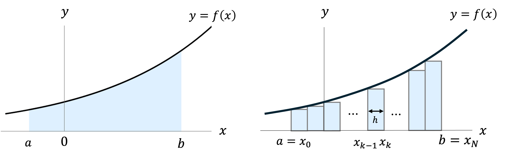

# 第14回　方程式の数値解法と数値積分


## 1. 方程式の数値解法

ある方程式 $f(x) = 0$の解を、数値計算を用いて近似的に求めよう。
ここでは、「2分法」と「ニュートン法」の2種類の解法を紹介します。

### 1-1. 二分法 (中間値の定理の応用)


**中間値の定理** 

 関数 $f(x)$ が区間 $[a,b]$ において連続であるとする。このとき、 $f(a)$ と $f(b)$ の間にある任意の数 $k$ に対し、 $f(c)=k$ を満たす点 $x=c$ が $(a,b)$ の中に少なくとも一つ存在する。


$f(x)=0$ の解は、 $f(a)f(b)<0$ を満たす区間 $(a,b)$ の中に少なくとも1つ存在する。
そこで、 $x=a$ と $x=b$ の中点 $x=c=(a+b)/2$ を考えると、 $f(x)=0$ の解は、 $f(a)f(c)<0$ なら区間 $(a,c)$ の中に、 $f(c)f(b)<0$ なら区間 $(c,b)$ の中に存在する。
このように、解が含まれている区間を半分にしていくことで解に迫っていく手法を二分法と呼ぶ。

**二分法のアルゴリズム**

1) $f(a)f(b)<0$ となるような $a,b~(a<b)$ を初期値にとる。
2) $c=(a+b)/2$ とする。
3) $f(c)=0$ ならば、 $x=c$ が解。 $f(a)f(c)<0$ ならば、 $c$ を新たな $b$ とする。 一方、 $f(c)f(b)<0$ ならば、 $c$ を新たな $a$ とする。
4) あらかじめ用意した小さな数 $\epsilon$ に対して、 $b-a<\epsilon$　となったら終了。 $x=(a+b)/2$ を解とする。

二分法を使って、 $\sin(x) =0$ の解を求めてみよう。

<details><summary>Pythonコード</summary>

```python
import math  # 数学関数（sin, piなど）を使うためにmathモジュールをインポート

# 解を求めたい関数 f(x) = sin(x)
def f(x):
    return math.sin(x)

# 解を探す初期区間 [a, b]
a = - math.pi / 6.0  
b = math.pi / 4.0

IMAX = 50     # 最大反復回数
EPS = 1e-6    # 許容誤差（収束判定のしきい値）

# 初期区間で f(a) と f(b) の符号が異なるか確認
if f(a) * f(b) >= 0:
    print("この区間には解がありません")  # 解の存在が保証されない場合
else:
    # 収束するか、最大反復数に達するまで繰り返す
    for i in range(IMAX):
        c = (a + b) / 2  # 区間の中点を計算
        print(i + 1, "c =", c)  # 何回目かと中点の値を出力

        if f(c) == 0:
            break  # 解がちょうど見つかった場合はループ終了
        elif f(a) * f(c) < 0:
            b = c  # 解は [a, c] にある → 右端を更新
        else:
            a = c  # 解は [c, b] にある → 左端を更新

        if b - a < EPS:
            break  # 区間幅が十分小さくなったら終了（収束とみなす）

    # 収束したかどうかを出力
    if i + 1 >= IMAX:
        print("It did not converged.")  # 最大反復数に達しても収束しなかった
    else:
        print("It converged.")  # 収束した
```

<details><summary>結果</summary>
  
```
1 c = 0.13089969389957473
2 c = -0.19634954084936204
3 c = -0.032724923474893655
4 c = 0.04908738521234054
5 c = 0.008181230868723442
6 c = -0.012271846303085107
7 c = -0.0020453077171808326
8 c = 0.0030679615757713045
9 c = 0.0005113269292952359
10 c = -0.0007669903939427984
11 c = -0.00012783173232378122
12 c = 0.00019174759848572735
13 c = 3.195793308097306e-05
14 c = -4.793689962140408e-05
15 c = -7.98948327021551e-06
16 c = 1.1984224905378776e-05
17 c = 1.997370817581633e-06
18 c = -2.9960562263169384e-06
19 c = -4.993427043676527e-07
20 c = 7.490140566069902e-07
21 c = 1.2483567611966874e-07
It converged.
```
</details>

</details>


### 1-2. ニュートン法 (微分を用いた数値解法)

関数 $f(x)=0$ を $x=x_n$ において、線形近似またはテイラー展開すると、 $f(x)\approx f(x_n) + f^\prime (x_n)(x-x_n)$ と書ける。そこで、 $f(x)=0$ の代わりに、"近似式の右辺"=0を解くと、 $x=x_n-\dfrac{f(x_n)}{f'(x_n)}$ となる。

適切な初期値 $x_0$ から出発して、 $x_{n+1}=x_n-\dfrac{f(x_n)}{f'(x_n)}$ にしたがって数列 $\lbrace x_n \rbrace$ を定義すると、数列 $\lbrace x_n \rbrace$ は $f(x)=0$ の解へと収束する。これをニュートン法と呼ぶ。


<details><summary>Pythonコード</summary>
 
#### $\sin x = 0$ をニュートン法を用いて解く。

```python
import numpy as np                   # 数値計算（等間隔配列など）に便利なライブラリ (mathの代わり)

# 解きたい方程式 f(X) = sin(X)
def f(X):
    return np.sin(X)

# f(X) の導関数
def df(X):
    return np.cos(X)

X0 = 1.0       # 初期値
EPS = 1e-7     # 許容誤差（収束判定用）
IMAX = 50      # 最大反復回数（収束しないときの打ち切り）

# 各ステップの近似解 X の値を記録するリスト（収束過程の可視化用）
X_vals = [X0]

# ニュートン法による反復
for i in range(IMAX):
    X1 = X0 - f(X0) / df(X0)  # ニュートン法の更新式

    # 収束判定：新旧の値の差が十分小さければ終了
    if abs(X1 - X0) < EPS:
        X_vals.append(X1)  # 最終値を記録
        break
    else:
        X0 = X1            # 初期値を更新
        X_vals.append(X0)  # 現在値を記録

    # 各ステップの値を表示
    print('X(', i+1, ') =', X1)

# 収束結果を出力
if i+1 >= IMAX:
    print('It did not converged')  # 収束しなかった場合
else:
    print('It converged')          # 収束した場合
```
<details><summary>結果</summary>
  
```
X( 1 ) = -0.5574077246549021
X( 2 ) = 0.06593645192484066
X( 3 ) = -9.572191932508134e-05
X( 4 ) = 2.923566201412306e-13
It converged
```
</details>

### 結果をグラフに描画してみる
```python
import matplotlib.pyplot as plt      # グラフ描画用のライブラリ

# -2 から 4 の範囲で f(X) = sin(X) のグラフを作成
x = np.linspace(-2, 4, 400)
y = np.sin(x)

plt.figure(figsize=(8, 5))
plt.plot(x, y, label='f(X) = sin(X)')              # 関数のグラフ
plt.axhline(0, color='gray', linestyle='--')       # x軸（y=0）

# 反復点を赤い点と線で表示
plt.plot(X_vals, [np.sin(x) for x in X_vals], 'ro-', label='Newton steps')

# 各ステップ番号を点のそばに表示（文字を少し上にずらして見やすく）
for idx, x_val in enumerate(X_vals):
    plt.text(x_val, np.sin(x_val) + 0.1, f"x{idx}", fontsize=9, ha='center')

# タイトルとラベル設定
plt.title('Newton Method for f(X) = sin(X)')
plt.xlabel('X')
plt.ylabel('f(X)')
plt.legend()
plt.grid(True)
plt.show()
```


</details>

#### 練習問題
- $\frac{\pi}{2}<x_0 < \frac{3}{2}\pi$ を初期条件として計算をスタートしたらどんな結果になるでしょう？

- 自分で方程式を考えて、それを解いてみましょう。


</details>


## 2. 数値積分法 

定積分は、原始関数がわかれば簡単に計算できる。しかし、原始関数が簡単には求まらない場合も多い。そのような時に、近似公式や数値計算を使って定積分の近似値を求める方法を数値積分という。

### 2-1. 区分求積法



定積分 $\displaystyle{\int_a^b} f(x)dx$ は、関数 $y=f(x)$ と $x$ 軸および2直線 $x=a, x=b$ で囲まれた図形の面積を表す。
この図形は、幅 $h = (b-a)/N$ 、高さ $f(x_{k-1})$ 　 $(k=1,2,...N)$ の帯の集まりであると近似できる。
よって、定積分 $\displaystyle{\int_a^b} f(x)dx$ は、帯の面積の総和
```math
S = \sum_{k=1}^N f(x_{k-1}) h =  \sum_{k=1}^N f(x_{k-1}) \frac{b-a}{N}
```
と近似できる。

<details><summary>Pythonコード</summary>
 
#### $\displaystyle{\int_0^1 \sqrt{1-x^2} dx} = \pi/4 \approx 0.785375$ を区分求積法を用いて求める。

```python
import numpy as np 

# 被積分関数 f(x) = sqrt(1 - x^2)
def f(x):
  return np.sqrt(1 - x**2)

A = 0.0   # 積分区間の左端（x = 0）
B = 1.0   # 積分区間の右端（x = 1）
N = 50    # 分割数（区間を N 個に分ける）
h = (B - A) / N  # 1つの小区間の幅 h

S = 0.0   # 積分値の初期化

# 長方形（左端）の和を求める
for k in range(1, N+1): # k = 1,2,...,N のループ
  S += f(A + h * (k - 1))  # 各区間の左端の f(x) を足し合わせる

S = S * h  # 全体を区間幅 h で掛けることで、積分の近似値を得る

print(S)  # 結果を出力
```
<details><summary>結果</summary>
 
```
0.7945671277746251
```

</details>

</details>


### 2-2. 台形公式


通常の区分求積法は長方形を用いて近似を行うが、台形を用いて近似した方が精度が良い。 
$k$ 番目の台形の面積 $S_k$ は、 $S_k = \frac{1}{2}\left(f(x_{k-1}) + f(x_k)\right) h$ となる。
したがって、台形で近似した場合の面積は、
```math
S=\sum_{k=1}^N S_k = \frac{h}{2}\sum_{k=1}^N \left(f(x_{k-1}) + f(x_k)\right)\\
=\frac{h}{2}\left\{f(x_0) + 2 \sum_{k=1}^{N-1}f(x_k) + f(x_N) \right\}
```
となる。これを台数公式と呼ぶ。


<details><summary>Pythonコード</summary>
 
#### 区分求積のときと同様、 $\displaystyle{\int_0^1 \sqrt{1-x^2} dx} = \pi/4 \approx 0.785375$ を区分求積法を用いて求める。

```python
import numpy as np  

# 被積分関数 f(x) = sqrt(1 - x^2)
def f(x):
  return np.sqrt(1 - x**2)

A = 0.0   # 積分区間の左端（x = 0）
B = 1.0   # 積分区間の右端（x = 1）
N = 50    # 分割数（区間を N 個に分ける）
h = (B - A) / N  # 1つの小区間の幅 h

S = 0.0   # 積分値の初期化

# 長方形（左端）の和を求める
for k in range(1, N): # k = 1,2,...,N-1 のループ
  S += 2.0 * f(A + h * k)

S = f(A) + S + f(B)
S = S * h / 2.0

print(S)  # 結果を出力
```
<details><summary>結果</summary>
 
```
0.784567127774625
```

</details>

</details>


